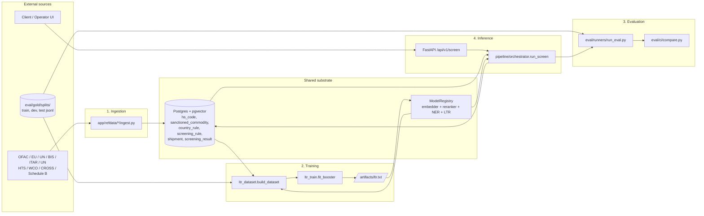

# Architecture overview

`new-sp-screening` is a sanctions / HS-classification screening service. It
takes free-text shipment descriptions, classifies them under the WCO HS
taxonomy, and matches them against sanctions reference data and operator
rules. This document is the entry point — each of the four flows below has its
own dedicated doc.

## The four flows

## Where to read next

| Doc | What it covers |
|---|---|
| [`naming-conventions.md`](naming-conventions.md) | Module layout, glossary of domain terms, proposed canonical names |
| [`ingestion.md`](ingestion.md) | Every refdata source: format, parser, target table, idempotency |
| [`training.md`](training.md) | Gold → features → LightGBM lambdarank → `artifacts/ltr.txt` |
| [`evaluation.md`](evaluation.md) | Runners, metrics, CI gate, thresholds |
| [`inference.md`](inference.md) | Stage-by-stage walkthrough of `run_screen` |
| [`data-flow-example.md`](data-flow-example.md) | End-to-end trace of one semiconductor shipment |
| [`sanctions-sources.md`](sanctions-sources.md) | Per-source provenance and operator workflow (pre-existing) |

## Runtime processes

The service runs as two long-lived process families plus the storage layer.

**FastAPI app** (`app/main.py:42`). Single process per replica. Serves the
synchronous screening endpoint `POST /api/v1/screen` and the admin / status
APIs. At startup (`app/main.py:30-37`) the lifespan handler loads the model
registry (`load_models()` in `app/models/registry.py`) and caches the static
version snapshot (`versions.compute_static()`); both are stashed on
`app.state` so request handlers reuse the same singletons.

**arq workers** (`app/workers/arq_app.py`). Background workers that run long
operations off the request path: refdata ingestion (`run_refdata`), model
training (`train_ltr`), evaluation (`run_eval_job`), and batch screening
(`batch_screen`). Each worker loads its own copy of the model registry on
boot.

**Postgres + pgvector** (`db/changelog/changes/*.sql`). Schema is managed by
Liquibase migrations (see `liquibase.properties`). Three feature families:
HNSW indexes (vector cosine) for dense semantic search, GIN indexes on
`description_tsv` for full-text search, and a trigram GIN index on
`sanctioned_commodity_alias.alias` for fuzzy party-name lookup.

## Boundaries between flows

The flows are loosely coupled around the database. Each flow's outputs are
the next flow's inputs — there is no shared Python state between them.

- **Ingestion writes refdata.** Populates `hs_code`, `hs_entity_index`,
  `hs_training_example`, `sanctioned_commodity`, `country_rule`,
  `sanctioned_commodity_alias`. Per-run progress goes into `refdata_run`.
- **Training reads refdata + gold, writes a model artifact.** Reads
  `eval/gold/splits/train.jsonl` (assembled from `hs_training_example`), runs
  the inference retrieval stack against each gold row to produce features,
  fits `artifacts/ltr.txt`. `training_run` tracks state.
- **Evaluation reads gold + a classifier, writes metrics.** The classifier is
  either the real pipeline (`pipeline_classifier.py`) or a baseline. Metrics
  land in `eval_run`; in CI, `eval/ci/compare.py` gates the PR against
  `eval/ci/thresholds.yaml`.
- **Inference reads refdata + the trained model, writes a screening result.**
  The orchestrator (`app/pipeline/orchestrator.py:run_screen`) runs the full
  pipeline per request. `Shipment` + `ScreeningResult` rows persist input
  and full payload; `versions` stamps which refdata and which model
  produced each result.

## Configuration

All runtime knobs are in `app/config.py` (Pydantic `BaseSettings`, env-prefixed). The
ones most often touched: `embedder_model`, `reranker_model`, `ner_model`,
`ltr_model_path`, `rerank_top_k`, `retrieval_top_k`, `fusion_mode` (`"rrf"`
default; `"max"` is the legacy rollback), `rrf_k`, `hnsw_ef_search`.
