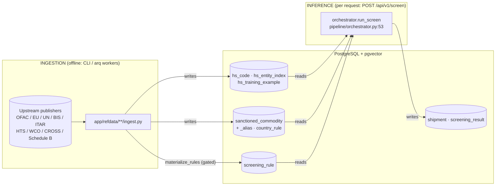
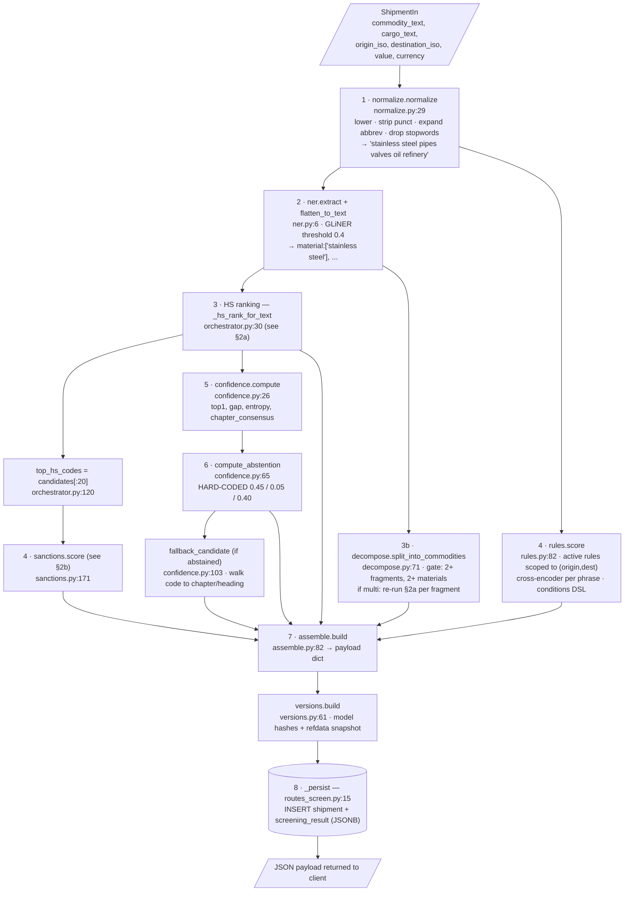
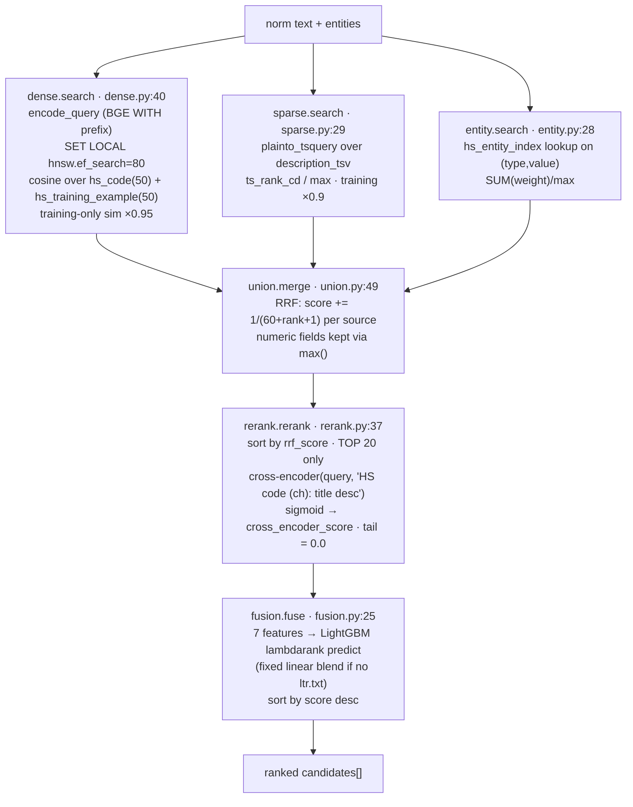
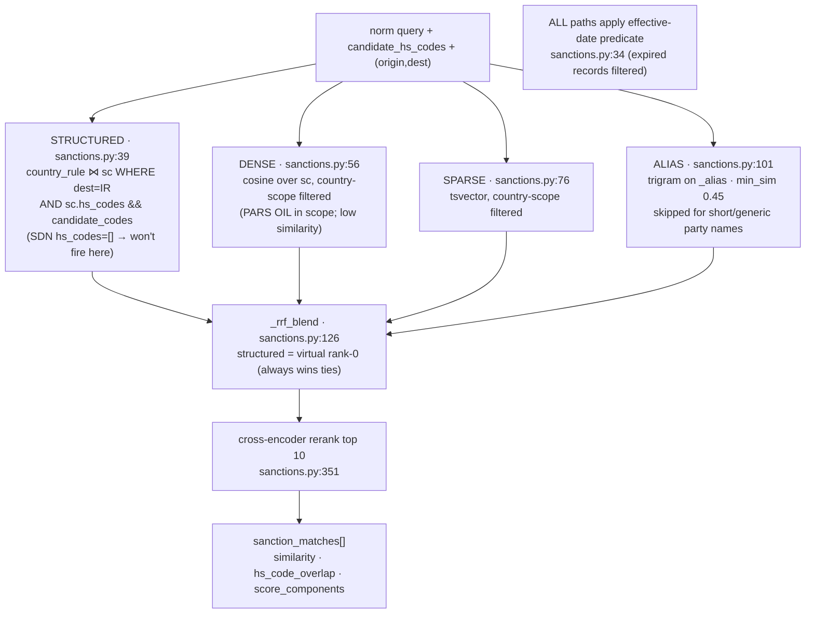

# Data flow: ingestion → storage → inference (visual)

This doc traces **one concrete data point** through each side of the system and
renders every transformation, storage step, and outcome-controlling setting as a
diagram. It is sourced from the code (not the prose docs); every node carries a
`file:line` anchor so it can be re-verified.

- **Ingestion example:** one OFAC SDN entry (an Iran-tagged entity).
- **Inference example:** one shipment, `commodity_text="SS pipes w/ valves for oil refinery"`, `origin=US`, `destination=IR`, `value=80000 USD`.

The two halves are independent in-process; they meet only through Postgres
reference tables.

## 0. The big picture

Models (embedder / reranker / NER / LTR) are a process-wide singleton loaded once
at startup (`models/registry.py:23`, `main.py:33`) and shared by both halves.

---

## 1. Ingestion — one OFAC SDN record

Entry: `app/refdata/sanctions/ofac_sdn/ingest.py:71`.

```mermaid
flowchart TB
    raw[("sdn.csv / add.csv / alt.csv<br/>headerless, latin-1, '-0-' = null")]

    raw --> read["_read_ofac_csv<br/>parser.py:73<br/>decode · pad · '-0-' to None"]
    read --> parse["parse(): build SdnRecord by ent_num<br/>parser.py:98<br/>split programs · join add/alt rows"]
    parse --> derive["derived_destination_isos<br/>parser.py:62<br/>PROGRAM_TO_ISO: IRAN to IR<br/>(SDGT/Russia: no auto-country)"]
    derive --> row["_record_to_row<br/>ingest.py:40<br/>description (joined, [:2000])<br/>hs_codes=[] · restriction='blocked'<br/>country_rules=[dest IR] · _aliases"]

    row --> run["with_run_logging('OFAC_SDN')<br/>refdata/common.py:17<br/>INSERT refdata_run(status=running)"]
    run --> upsert["upsert_sanctioned_commodities<br/>sanctions/common.py:21 (batches of 64)"]

    upsert --> embed["embedder.encode_batch(descriptions)<br/>embedder.py:35<br/>BGE-small · DOCUMENT side = NO prefix<br/>384-d normalized vector"]
    embed --> insSC[("INSERT sanctioned_commodity<br/>ON CONFLICT (source, source_record_id)<br/>DO NOTHING — common.py:59")]
    insSC --> insCR[("INSERT country_rule(dest=IR, blocked)<br/>ON CONFLICT DO NOTHING — common.py:77")]
    insCR --> tsv["update_tsv_for_table('description')<br/>common.py:56 — WHERE tsv IS NULL"]
    tsv --> alias[("2nd pass: INSERT sanctioned_commodity_alias<br/>ingest.py:116 · trgm GIN index · ON CONFLICT DO NOTHING")]
    alias --> ok["refdata_run(status=success, rows_upserted)<br/>+ job_log"]
```

**Final stored shape of this one record**

| Table | Row written |
|---|---|
| `sanctioned_commodity` | `source=OFAC_SDN, source_record_id=12345, description="PARS OIL CO (entity) \| programs: IRAN, SDGT \| countries: Iran", hs_codes=[], embedding=<384-d>, description_tsv` |
| `country_rule` | `destination_iso=IR, sanctioned_commodity_id=N, restriction_type=blocked, active=true` |
| `sanctioned_commodity_alias` | `alias="PARS PETROLEUM", alias_kind="aka"` |
| `refdata_run` + `job_log` | audit trail (Status UI) |

**Ingestion nuances**

1. **Sanctions are insert-only** (`ON CONFLICT DO NOTHING`, `common.py:59`). A
   changed description/embedding on an existing `ent_num` is **not** refreshed on
   re-ingest. HS taxonomy, by contrast, uses `DO UPDATE` (`hts/ingest.py:148`).
2. **`description_tsv` is only built `WHERE … IS NULL`** (`common.py:56`), so an
   edited description keeps stale full-text tokens.
3. **SDN carries `hs_codes=[]`** — it can never match the structured HS-overlap
   sanctions path; it surfaces only via `country_rule` + semantic similarity.
4. Only comprehensive-embargo programs auto-attach a country (`PROGRAM_TO_ISO`,
   `parser.py:31`); sectoral programs (SDGT, Russia) intentionally do not.
5. Rows with **`NULL source_record_id` insert every run** — Postgres treats NULL
   as distinct in the unique constraint (`common.py:33`).

---

## 2. Inference — one shipment, end to end

Entry: `routes_screen.py:48` → `orchestrator.run_screen` (`orchestrator.py:53`).
Same-lane boxes run concurrently; arrows are data dependencies.

### 2a. HS ranking sub-flow (`_hs_rank_for_text`, `orchestrator.py:30`)

### 2b. Sanctions sub-flow (4 paths, `sanctions.py:171`)

---

## 3. Every setting that controls an inference outcome

### Env-configurable (`app/config.py`) — change + **restart**

| Setting | Default | Effect |
|---|---|---|
| `fusion_mode` | `rrf` | `rrf` ↔ `max` flips the entire blend in HS **and** sanctions |
| `rrf_k` | 60 | RRF denominator constant |
| `retrieval_top_k` | 50 | candidates pulled per retrieval branch |
| `rerank_top_k` | 20 | how many reach the HS cross-encoder; rest get score 0 |
| `sanctions_rerank_top_k` | 10 | how many reach the sanctions cross-encoder |
| `hnsw_ef_search` | 80 | pgvector recall vs CPU (per-transaction `SET LOCAL`) |
| `embedder_use_query_prefix` | true | asymmetric BGE query instruction |
| `embedder_model` / `reranker_model` / `ner_model` / `ltr_model_path` | BGE / GLiNER / `./artifacts/ltr.txt` | the models themselves |

### Hard-coded constants (source-only)

`confidence.py`: abstention `top1<0.45`, `gap<0.05`, `chapter_consensus_floor 0.40`.
`ner_model.py:39`: GLiNER threshold 0.4. `reranker.py:15`: `max_length=256` (long
descriptions truncated). `sanctions.py:219`: alias `min_sim 0.45`. `decompose.py`:
`MAX_FRAGMENTS=5`, `MIN_FRAGMENT_LEN=5`. dense/sparse training penalties ×0.95 /
×0.9. `ltr.py:49`: fallback weights `[.20,.10,.15,.45,.05,0,.05]`.
`orchestrator.py:120`: `candidates[:20]` cap feeding sanctions.

### DB-driven (no restart) — change outcomes live

| Table | What it controls |
|---|---|
| `screening_rule` | which rules fire: `active`, `threshold`, `phrase_group`, origin/dest scope, `conditions` DSL |
| `sanctions_rule_config` | **gates** rule materialization: `enabled` (off by default), `default_threshold` 0.55, `phrase_strategy` (`materialize_rules.py:250`) |
| `country_rule` | `active` + scope gate the structured & country-filtered sanctions paths |
| `sanctioned_commodity.effective_from/to` | expired records filtered from all sanctions paths |

---

## 4. Cross-cutting nuances (easy to miss)

1. **The `threshold` table does NOT feed the live pipeline.** `run_screen` calls
   `compute_abstention(candidates, conf)` with no overrides (`orchestrator.py:152`),
   so the cutoffs are hard-coded. `threshold` / `eval/ci/thresholds.yaml` are used
   only by the Status UI and CI gate (`routes_thresholds.py`), and their keys are
   unrelated eval metrics. Editing them changes nothing about screening output.
2. **Models never hot-reload.** The registry is a singleton loaded once
   (`registry.py:23`). A retrained `ltr.txt` or changed model env var only takes
   effect on process restart — inference silently lags retraining until redeploy.
3. **ISO codes are matched case-sensitively and not normalized at the boundary.**
   `ShipmentIn` (`schemas/screen.py:7`) does no uppercasing; OFAC stores `"IR"`.
   A client sending `"ir"` silently misses structured + route-filtered sanctions.
4. **The decompose confidence gate is effectively inert.** Once the structural
   conditions pass (≥2 fragments, ≥2 distinct materials), `conf ≥ 0.8`
   (`decompose.py:112`), always clearing the `0.5` gate. The real gate is structural.
5. **The batch inference path omits `versions`** (`batch_screen.py:43`) whereas the
   sync `/screen` route persists it (`routes_screen.py:29`).
6. **Retrieval depth interaction:** RRF sort → only top-20 reach the cross-encoder
   → LTR fallback weights cross-encoder at 0.45. A candidate ranked >20 after RRF
   gets `cross_encoder_score = 0` and is effectively capped out of the final top,
   regardless of dense/sparse strength. `retrieval_top_k`, `rerank_top_k`, and
   `fusion_mode` therefore interact rather than act independently.
