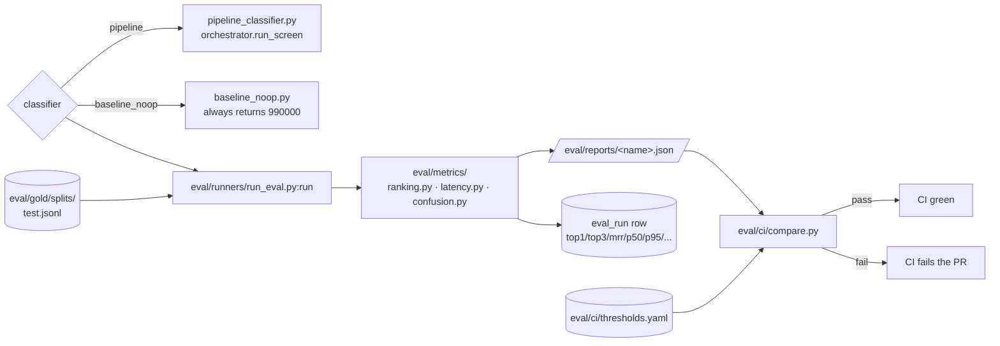

# Evaluation

The eval flow grades a classifier (the real pipeline or a baseline)
against the held-out gold split, persists metrics, and gates PRs on
regressions.

## Flow



## Gold format

JSONL at `eval/gold/splits/{train,dev,test}.jsonl`. Built by
`GoldAssembly` (`app/refdata/gold/assemble.py`) from `hs_training_example`;
stratified by 2-digit chapter; 70/15/15 split. Each line:

```json
{"description": "<free text>", "hs_code": "<6-digit>"}
```

Loaded by `run_eval._load_split` (`eval/runners/run_eval.py:30-40`),
which skips blank lines and `#` comments.

## Classifiers

Each classifier is a Python module under `eval/runners/` exposing a
`Classifier` class with `async def classify(description: str) -> list[str]`
returning a ranked HS-code list. `_load_classifier`
(`eval/runners/run_eval.py:43-48`) imports by name:

| Name | Module | What it does |
|---|---|---|
| `pipeline` | `eval/runners/pipeline_classifier.py` | Calls `orchestrator.run_screen` and returns the HS codes from `top_candidates`. **This is the real pipeline.** |
| `baseline_noop` | `eval/runners/baseline_noop.py` | Always returns `["990000"]`. Floor. |
| `run_rule_eval` / `run_sanctions_eval` | `eval/runners/*.py` | Specialized eval harnesses for rules and sanctions retrieval; not part of the gold-set HS gate. |

To add a new classifier, drop a module with `Classifier.classify(...)`
into `eval/runners/` and pass `--classifier <name>`.

## Metrics

Computed by `run_eval.run` after every query has been classified
(`eval/runners/run_eval.py:122-141`).

### Ranking (`eval/metrics/ranking.py`)

| Metric | Definition |
|---|---|
| `top1_subheading` | Fraction of queries whose gold 6-digit code is the first prediction. |
| `top3_subheading` | …is in the first 3 predictions. |
| `top5_subheading` | …is in the first 5. |
| `top1_heading` | Top-1 prediction shares the gold's 4-digit prefix. |
| `top1_chapter` | Top-1 prediction shares the gold's 2-digit prefix. |
| `mrr` | Mean reciprocal rank of the gold code across predictions. |

`top_k_subheading` / `top_k_heading` / `top_k_chapter` /
`mean_reciprocal_rank` are stateless pure functions over
`(predictions: list[list[str]], gold: list[str])`.

### Latency (`eval/metrics/latency.py`)

Per-query wall-clock latency in ms, summarized to `p50` / `p95` / `p99` /
`mean`. Measured around the `classify(...)` call
(`run_eval.py:113-115`), so it includes the full pipeline cost for the
`pipeline` classifier.

### Confusion (`eval/metrics/confusion.py`)

`chapter_confusion(predictions, gold)` builds the gold-chapter ×
predicted-chapter confusion matrix. `hardest_pairs` surfaces the
heaviest off-diagonal cells — useful for spotting systematic
misclassifications (e.g., chapter 38 vs 28 chemistry confusions).

## Persistence — `EvalRun`

`_persist_run` (`eval/runners/run_eval.py:51-77`) inserts an `EvalRun`
row (`app/db/models.py:223-237`) after the run completes:

```text
classifier · split · top1_subheading · top3_subheading · top1_chapter ·
mrr · p50_ms · p95_ms · p99_ms · n_examples · report_json
```

`report_json` is the full report (including the confusion matrix and
hardest pairs). Index `eval_run_classifier_split_ran` makes
"latest run for classifier X / split Y" cheap.

## CI gate — `eval/ci/compare.py`

Thresholds live in `eval/ci/thresholds.yaml`:

```yaml
top1_subheading: 0.85
top3_subheading: 0.95
top1_chapter: 0.95
mrr: 0.85
p95_ms: 1000
```

`compare.main` (`eval/ci/compare.py:25-64`) reads a report JSON and
applies a tolerance band (`:16-22`):

```python
TOLERANCE = {
    "top1_subheading": -0.005,   # 0.5pp slack
    "top3_subheading": -0.005,
    "top1_chapter":    -0.005,
    "mrr":             -0.005,
    "p95_ms":          50,       # 50ms slack
}
```

For accuracy metrics, `actual >= threshold + slack` passes. For latency,
`actual <= threshold + slack` passes. Any failure exits non-zero and
fails the PR.

The gate runs in `.github/workflows/eval-gate.yml`. Today it runs the
`baseline_noop` classifier against `eval/gold/splits/test.jsonl` and is
marked `continue-on-error: true` — the gate is in observe-only mode
until the pipeline is wired end-to-end in CI. Flip the
`continue-on-error` to `false` (and switch the classifier to `pipeline`)
to make the gate blocking.

## Triggering eval

### From the API / UI

```text
POST /api/v1/eval/run
```

`app/api/routes_eval.py` enqueues the `run_eval_job` arq job
(`app/workers/eval_jobs.py:40`). Params:

| Param | Default | Meaning |
|---|---|---|
| `classifier` | `pipeline` | classifier module name |
| `split` | `test` | `train` \| `dev` \| `test` |
| `limit` | unset | optional cap |

A new `EvalJob` row (`app/db/models.py:278-288`) tracks worker state;
on success it back-fills `eval_run_id` to the `EvalRun` the runner
created. Progress lines stream into `job_log`.

### From the CLI

```bash
python -m eval.runners.run_eval --classifier pipeline --split test --report eval/reports/run.json
python -m eval.ci.compare --report eval/reports/run.json
```

The runner's `--report` flag writes the full JSON; pass that into the
gate. `_persist_run` (`run_eval.py:51`) tries to write an `EvalRun` row
opportunistically — it logs and continues on failure, so the CLI works
without a Postgres reachable.

## What the dashboard shows

The Status / Eval pages tail `EvalRun` and the live `EvalJob` via the
admin / dashboards routes; `JobLog` rows stream over SSE. The same
metrics surface in two places intentionally — `EvalRun` is the
quantitative record, `EvalJob` is the lifecycle / debugging record.
