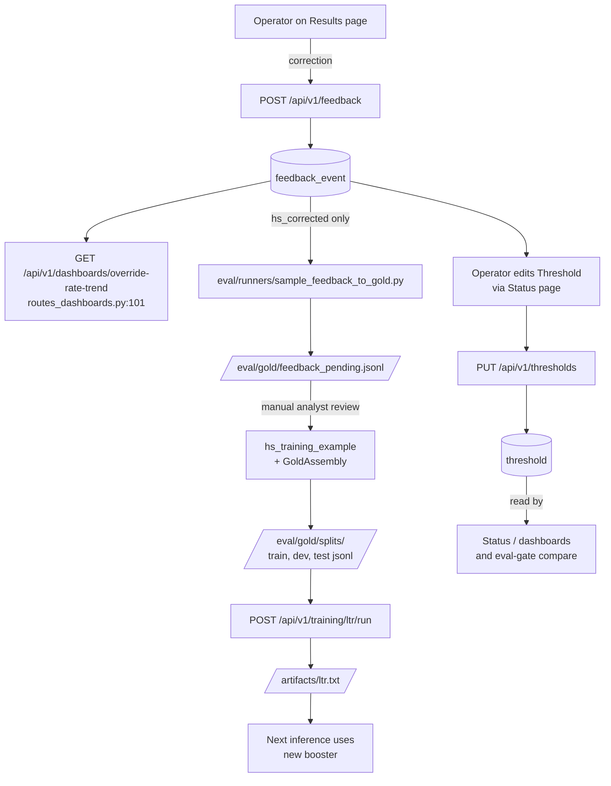

# Feedback loop

Inference produces a `ScreeningResult`. Operators review it. Their
corrections, dismissals, and escalations land in `feedback_event`.
This doc traces how those events influence the *next* screening — via
threshold tuning, gold-set expansion, and LTR retraining.

## Flow



There are **three independent corrective levers**:

1. **Threshold tuning** — fastest, no retrain. Adjusts the
   pass/fail bands on `top1_subheading`, `p95_ms`, etc.
2. **Rule iteration** — operator-authored. New version of a rule via
   `PUT /api/v1/rules/{id}` is a same-process change picked up by the
   next request.
3. **Model retraining** — slowest, requires curating feedback into
   gold and retraining the LTR booster.

## The feedback event

`FeedbackEvent` rows (`app/db/models.py:196-205`) are written by
`POST /api/v1/feedback` (`app/api/routes_feedback.py:24-42`). The
schema:

```text
id            bigserial PRIMARY KEY
result_id     uuid REFERENCES screening_result(id)
analyst_id    text
event_type    varchar(32)        -- hs_corrected | sanction_dismissed | rule_dismissed | escalated
before_value  jsonb              -- what the engine said
after_value   jsonb              -- what the operator says
notes         text
created_at    timestamptz
```

The four `event_type` values come from the inline comment at
`app/api/routes_feedback.py:17`. Each carries a different downstream
effect:

| `event_type` | Operator action | Downstream effect |
|---|---|---|
| `hs_corrected` | Top-1 HS code is wrong; analyst supplies the correct code | Sampler eligible; promoted to gold candidate for next LTR retrain |
| `sanction_dismissed` | Sanction match is a false positive | Visible on the Result page; powers the "override-rate-trend" chart; no automatic refdata change |
| `rule_dismissed` | Rule fire is a false positive | Same: surfaced, charted, but the rule itself is unchanged until the operator edits it |
| `escalated` | Result needs human review beyond the analyst | Surfaced; downstream workflow decides |

### Recommended payload shape

The `before_value` / `after_value` shape is JSON, intentionally open.
A consistent convention makes the downstream sampler trivial. For HS
corrections (the only kind currently fed back into training):

```json
POST /api/v1/feedback
{
  "result_id":    "9e7e5c0a-3f2b-4f3a-9d2e-3a1c4b7f0123",
  "event_type":   "hs_corrected",
  "before_value": {"hs_code": "854231", "score": 0.64},
  "after_value":  {"hs_code": "381800"},
  "notes":        "Wafer description; engine over-weighted 'integrated circuits' keyword.",
  "analyst_id":   "anna.kowalski"
}
```

For dismissals:

```json
{
  "result_id":    "...",
  "event_type":   "sanction_dismissed",
  "before_value": {"source": "BIS_CCL", "source_record_id": "ECCN_3C001"},
  "after_value":  null,
  "notes":        "Exempted by license #XYZ; logged for traceability."
}
```

## Lever 1 — Threshold tuning (no retrain)

The `threshold` table holds editable ship-gate values. On first read
the table is seeded from `eval/ci/thresholds.yaml`
(`app/api/routes_thresholds.py:33-40`); thereafter the UI is the source
of truth. The Status page renders the current values and the YAML
seed side-by-side so operators can see how far they've drifted.

```text
PUT /api/v1/thresholds      → upsert one (key, value), source="ui"
POST /api/v1/thresholds/reset → overwrite all back to YAML seed
GET /api/v1/thresholds        → list current + YAML seed
```

**Where thresholds are consumed.** `eval/ci/compare.py` reads the
YAML at PR time — the YAML, *not* the DB — so editing thresholds from
the UI affects the live Status dashboard (`/api/v1/status/eval`'s
`latest_pass_fail` map at `routes_status.py:258+`) but not the CI gate.
Move a UI-tuned value into the YAML when promoting a calibration.

**When to reach for this lever.** A small accuracy drop on a recent
eval run that you don't want to block on while investigating; a p95
latency creep tied to a known-temporary cause (a slow refdata refresh
day, for example). Don't tune the YAML to chase a regression — that
hides bugs.

## Lever 2 — Rules iteration (no retrain)

`rule_dismissed` feedback is the strongest signal that a rule's
`phrase`, `phrase_group`, or `conditions` need work. The operator's
edit path:

1. `GET /api/v1/rules/{id}` to see current phrase + history.
2. `POST /api/v1/rules/{id}/test` with sample cargo text to dry-run.
3. `PUT /api/v1/rules/{id}` with the new fields; the route inserts a
   new row with `version+1` and deactivates the old one
   (`app/api/routes_rules.py:107-138`). History is preserved.

Because rules carry their own version, a `ScreeningResult` written
last week still references the rule version it actually evaluated
against — important for audit. The Results page surfaces
`rule_match.version` from the persisted payload.

## Lever 3 — Retrain the LTR

`hs_corrected` feedback is the only `event_type` the sampler ingests
today. The full path:

### Step 1 — sample feedback into a pending file

```bash
python -m eval.runners.sample_feedback_to_gold --since 2026-01-01
```

`eval/runners/sample_feedback_to_gold.py:26-48` joins
`FeedbackEvent → ScreeningResult → Shipment`, filters to
`event_type == "hs_corrected"`, takes `after_value.hs_code` as the
gold label, and writes `eval/gold/feedback_pending.jsonl`:

```json
{"description": "<shipment.commodity_text>", "hs_code": "<after>", "from_feedback_id": 42}
```

This file is **pending review** — it is not picked up automatically.
The `from_feedback_id` field is the audit trail back to the originating
event.

### Step 2 — secondary analyst review (manual)

A second analyst reviews each row. This is intentionally a manual gate
— a single operator's correction is one signal, but training data
needs more diligence (the description and the gold HS code form a
permanent (text, label) pair). Approved rows are merged into
`hs_training_example` (via your team's preferred ingest path —
typically a small CSV upload through the `ScheduleB` slot or a direct
insert script). Currently there is no API endpoint that does this
merge; it's a deliberate manual step.

### Step 3 — re-assemble gold

```text
POST /api/v1/admin/refdata/GoldAssembly/run
```

`GoldAssembly` (`app/refdata/gold/assemble.py`) re-samples
`hs_training_example` (which now includes the approved feedback rows)
into stratified `eval/gold/splits/{train,dev,test}.jsonl`. The random
seed defaults to 42 so the resampling is reproducible
(`assemble.py:42`).

### Step 4 — retrain

```text
POST /api/v1/training/ltr/run
```

Phase 1 of `train_ltr` (`app/workers/training_jobs.py:42`) rebuilds
`artifacts/ltr_train.csv` from the new gold; Phase 2 fits the booster
and writes `artifacts/ltr.txt`. See [`training.md`](training.md) for
hyperparams and the feature-order footgun.

### Step 5 — reload

The FastAPI process loads the booster once at startup
(`app/main.py:33`). Restart the API (and the arq worker) so the new
booster is picked up. The `versions.ltr_hash` field on every
subsequent `ScreeningResult` will reflect the new SHA-256, making it
easy to identify which screenings ran on which booster during audit.

### Step 6 — verify with an eval run

```text
POST /api/v1/eval/run  { "classifier": "pipeline", "split": "test" }
```

Compare the resulting `EvalRun.top1_subheading` against the prior best
(via `/api/v1/data/eval-runs`). Promote the booster if green; roll
back by deleting `artifacts/ltr.txt` and restarting (the
`LtrRanker.__init__` fallback at `app/models/ltr.py:33-50` takes over
and the pipeline still runs).

## Monitoring the loop

Two endpoints surface aggregate feedback health:

- `GET /api/v1/dashboards/override-rate-trend`
  (`app/api/routes_dashboards.py:101`) — per-2-digit-chapter
  `corrections / total` rate. Chapters with high rates are LTR weak
  spots and should be over-represented in the next gold sample.
- `GET /api/v1/feedback/{result_id}` — the audit trail for a single
  result. Surfaced on the Result detail page in the UI.

The override-rate chart is the single most actionable signal in this
flow. A persistent rise in a chapter's override rate is the trigger
for the retrain cycle above.

## What to keep out of the loop

- **Sanctions reference data.** A `sanction_dismissed` event does *not*
  modify `sanctioned_commodity` or `country_rule`. Refdata is
  authoritative — analysts dismiss false positives at the result
  level, not by deleting source records. If a publisher genuinely
  withdraws a sanction, re-running ingest after the publisher updates
  is the right path.
- **NER / embedder / reranker.** None of these are trained in this
  repo (see [`training.md`](training.md) §"What's *not* trained
  here"). Pretrained models are swapped via config, not feedback.
- **Threshold YAML.** Editing `eval/ci/thresholds.yaml` is a
  reviewed PR change, not a UI action. The UI edits a separate
  DB-backed copy.

## In one paragraph

Operator correction → `feedback_event` → choose the cheapest lever
that fixes it (threshold tweak, rule edit, or retrain via
sample-feedback-to-gold → GoldAssembly → train_ltr). Reload the API to
pick up a new booster. Track success via the override-rate dashboard
chart per chapter, and audit via `versions.ltr_hash` on every
subsequent screening.
