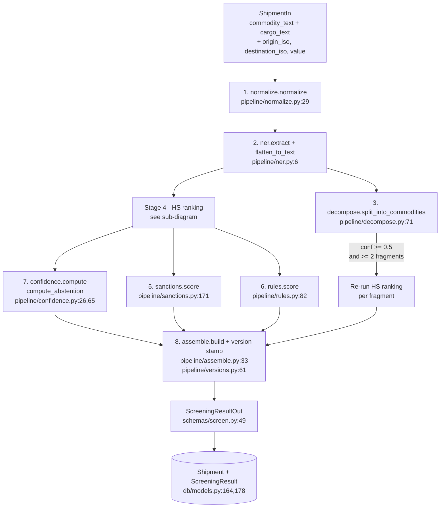
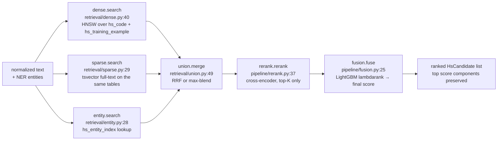

# Inference (screening)

A `POST /api/v1/screen` request enters `routes_screen.screen`
(`app/api/routes_screen.py:48`), which calls
`orchestrator.run_screen` (`app/pipeline/orchestrator.py:53`). The
orchestrator runs an eleven-stage pipeline whose stages are listed in
the diagram below. Stages with the same lane run in parallel; arrows are
data dependencies.

## End-to-end pipeline



Sub-diagram for the HS ranking stage:



## Request shape

`ShipmentIn` (`app/schemas/screen.py:7-15`):

```python
class ShipmentIn(BaseModel):
    external_ref:     str | None = None
    commodity_text:   str
    cargo_text:       str | None = None
    origin_iso:       str | None = None
    destination_iso:  str | None = None
    shipment_value:   float | None = None
    currency:         str | None = None
    metadata:         dict[str, Any] | None = None
```

## Stage-by-stage walkthrough

### 1. Normalize — `pipeline/normalize.py:29`

**Input.** Concatenation of `commodity_text` and (if present) `cargo_text`.

**Output.** Lowercased, punctuation-stripped, abbreviation-expanded
single-space-joined token sequence with stop tokens removed.

**Why.** Stable surface form for every downstream consumer (NER, both
retrieval paths). The abbreviation map (`ABBREV_EXPANSIONS`, `:3-21`) and
stop-token set (`:23`) are small and conservative.

### 2. NER — `pipeline/ner.py:6`

**Input.** Normalized text.

**Output.** Two shapes, both used downstream:

- *Structured*, kept for the UI: `{label: [{text, start, end, score}]}`
  (`ner.extract`, `:6-8`).
- *Flat*, used by retrieval and decomposition: `{label: [text, ...]}`
  (`ner.flatten_to_text`, `:11-27`).

**Why.** The GLiNER labels (`material`, `product`, `measurement`,
`form`, `end_use`, …) are joined against `hs_entity_index` in the entity
retrieval branch and against the material list in the decomposer.

**Note.** Runs on a thread (`asyncio.to_thread`) because the model is
synchronous (`orchestrator.py:76`).

### 3. Decompose — `pipeline/decompose.py:71`

**Input.** Normalized text + flat NER entities.

**Output.** `Decomposition(fragments, confidence)`. Each fragment is a
`CommodityFragment(text, materials)`.

**Why.** Some shipment lines describe multiple distinct commodities
("1000T steel coil + 500L industrial paint"). The pipeline's primary HS
branch is single-result; the decomposer surfaces a list of sub-texts so
the orchestrator can re-rank each and emit one top-1 HS code per
commodity.

**Gate.** `orchestrator.py:96` requires `confidence >= 0.5` *and*
`len(fragments) >= 2` before splitting. False negatives are preferred —
incorrectly splitting one commodity adds latency and noise.

### 4. HS ranking — `orchestrator._hs_rank_for_text` (`:30-50`)

Composite stage that runs every screening (and re-runs per fragment if
decomposition fired). Four sub-stages:

#### 4a. Dense retrieval — `retrieval/dense.py:40`

Two pgvector HNSW lookups on the same query vector:

- `hs_code` (taxonomy rows) → `dense_similarity` per candidate.
- `hs_training_example` → `dense_via_training` per candidate (a small
  haircut applied at `:76` so a synthetic example never out-ranks an
  exact taxonomy match).

`hnsw.ef_search` is set with `SET LOCAL` at `:47` so the recall knob
applies only to this transaction.

#### 4b. Sparse retrieval — `retrieval/sparse.py:29`

Postgres `ts_rank_cd(description_tsv, plainto_tsquery('english', q))`
against both `hs_code` and `hs_training_example`, max-normalized into
`sparse_score`.

#### 4c. Entity retrieval — `retrieval/entity.py:28`

Joins the flat `{entity_type: [value...]}` against `hs_entity_index`
via a Postgres `text[][]` literal `{{material,silicon},...}`, summing
the per-pair `weight`. Max-normalized into `entity_overlap_score`.

#### 4d. Union merge — `retrieval/union.py:49`

Merges the three candidate lists by `hs_code`, preserving per-source
scores (`dense_similarity`, `dense_via_training`, `sparse_score`,
`entity_overlap_score`) and accumulating a rank-based `rrf_score` when
`settings.fusion_mode == "rrf"` (the default). The `"max"` legacy mode
is a no-restart rollback.

#### 4e. Cross-encoder rerank — `pipeline/rerank.py:37`

Sorts by `_retrieval_score` (RRF or max-blend), takes the top-K
(`settings.rerank_top_k`, default 20), and scores each (query,
candidate_text) pair with the BGE reranker. Sigmoid-squashed logits land
on each candidate as `cross_encoder_score`. Tail candidates get
`cross_encoder_score = 0`.

#### 4f. LightGBM fusion — `pipeline/fusion.py:25`

Materializes the seven-feature vector (`FEATURE_ORDER` from
`app/models/ltr.py:10-18`):

```text
dense_similarity   sparse_score   entity_overlap_score   cross_encoder_score
chapter_prior      candidate_depth   top1_minus_top2_gap
```

`chapter_prior` and `top1_minus_top2_gap` are computed over the
candidate list at this stage; the rest are per-candidate. The booster's
predictions become each candidate's final `score` and a transparent
`score_components` dict (`:56-64`). Candidates are sorted by `score`
descending.

### 5. Sanctions match — `pipeline/sanctions.py:171`

Runs in parallel with rules. Four async paths, all gated by an
"effective date" predicate (`_EFFECTIVE_DATE_CLAUSE`, `:34-37`) so
expired rows don't surface:

| Path | Query | Purpose |
|---|---|---|
| Structured (`STRUCTURED_QUERY`, `:39-54`) | JOIN `country_rule` ↔ `sanctioned_commodity` filtered by `origin_iso` / `destination_iso` and HS overlap via `&&` | Surfaces rule-based matches even when semantic similarity is low |
| Dense (`DENSE_QUERY`, `:56-74`) | pgvector cosine on `sanctioned_commodity.embedding` filtered by country scope | Semantic match — catches paraphrases |
| Sparse (`SPARSE_QUERY`, `:76-94`) | `ts_rank_cd` on `description_tsv` filtered by country scope | Token-level match |
| Alias (`ALIAS_QUERY`, `:101-115`) | trigram `similarity()` on `sanctioned_commodity_alias.alias` | Fuzzy party-name match |

`_rrf_blend` (`:126-168`) folds the four ranked lists into a single
`rrf_score` per `sanctioned_commodity_id`. The top-N (`sanctions_rerank_top_k`,
default 10) get cross-encoder rerank for a `cross_encoder` field; the
tail gets 0. Output rows match the wire shape used in
`payload["sanction_matches"]`.

### 6. Rules match — `pipeline/rules.py:82`

Fetches active `ScreeningRule` rows whose `(origin_iso, destination_iso)`
scope matches the shipment (NULL on either column means "any"). For each
rule:

1. Resolve phrases — either the legacy single `rule.phrase` or the
   group form `{"mode": "any_of"|"all_of", "phrases": [...]}`.
2. Batch the (cargo_text, phrase) pairs into a single reranker call,
   sigmoid the logits, then combine per-rule with `max()` for `any_of`
   and `min()` for `all_of` (`_combine`, `:73-79`).
3. Evaluate the JSON conditions DSL against the shipment context
   (`_eval_conditions`, `:37-54`): `min_value` / `max_value` /
   `currency_in` / `metadata_eq`, ANDed.

Output rows carry `phrase_similarity`, `threshold`,
`delta_above_threshold`, `conditions_satisfied`, and a per-phrase
breakdown for transparency.

### 7. Confidence + abstention — `pipeline/confidence.py:26,65`

`compute(candidates)` returns five metrics (`:26-62`):

```python
{
  "top1_score": ...,
  "top1_minus_top2": ...,
  "entropy_topk": ...,        # over normalized top-10 scores
  "chapter_consensus": ...,   # max mass on any 2-digit chapter
  "cross_source_agreement":   # dense AND sparse AND cross_encoder all positive
}
```

`compute_abstention(candidates, conf)` (`:65-97`) decides whether to
flag low confidence and, if so, suggests a fallback granularity:

- `top1_score < 0.45` ⇒ abstain. Fallback = `4` if chapter consensus is
  strong, else `2`.
- `top1_minus_top2 < 0.05` AND `chapter_consensus < 0.4` ⇒ abstain with
  `fallback_level=2`.
- otherwise ⇒ not abstained.

If abstaining, `fallback_candidate(...)` (`:103-134`) walks the top
candidate's HS code to the requested 2/4-digit prefix and returns a
candidate-shaped dict.

**This stage does *not* produce a categorical disposition (BLOCK / CLEAR /
REVIEW).** That's by design — the engine surfaces uncertainty; downstream
systems decide what to do with it.

### 8. Assemble + version stamp — `pipeline/assemble.py:33`, `pipeline/versions.py:61`

`assemble.build(...)` constructs the response dict
(`pipeline/assemble.py:61-79`):

- `top_candidates`: top-N (default 10) candidate views.
- `chapter_distribution`: top-10 mass per 2-digit chapter, normalized.
- `confidence_metrics` + `abstained` / `abstain_reason` /
  `fallback_level` / `fallback_candidate`.
- `multi_commodity`: per-fragment top-1 (or `None`).
- `extracted_entities`: the structured NER output.
- `latency_ms`: snapshot of `StageTimer` marks.
- `versions`: snapshot returned by `versions.build`
  (engine + embedder + reranker + NER + LTR hash + per-source refdata
  timestamps).

The orchestrator then attaches `sanction_matches` and `rule_matches` to
the payload (`orchestrator.py:174-175`) before returning.

## Response shape

`ScreeningResultOut` (`app/schemas/screen.py:49-58`):

```python
class ScreeningResultOut(BaseModel):
    shipment_id:        UUID
    engine_version:     str
    hs_classification:  HsClassification        # see below
    sanction_matches:   list[dict[str, Any]]    # per sanctions.py output
    rule_matches:       list[dict[str, Any]]    # per rules.py output
    extracted_entities: dict[str, Any]          # structured NER
    latency_ms:         dict[str, int]          # ner / retrieval_rerank_fusion / ...
    versions:           dict[str, Any] | None   # engine, models, refdata snapshot
```

`HsClassification` (`schemas/screen.py:36-46`) carries the
top-candidates list, chapter distribution, confidence metrics,
abstention surface (4 fields), and the optional `multi_commodity` list.

## Persistence

`routes_screen._persist` (`app/api/routes_screen.py:15-41`) writes two
rows on every screening:

- `Shipment` (`app/db/models.py:164-175`): raw input + `external_ref`.
- `ScreeningResult` (`:178-193`): the full classification, sanctions,
  rules, entities, confidence, latency, and version snapshot.

Index `screening_result_shipment` (declared in `0001-init.sql:233`)
makes shipment → result lookups cheap.

## Latency anatomy

`StageTimer.mark(name)` is called between stages
(`orchestrator.py:78, 89, 113, 148, 176`). The `latency_ms` block on
the response carries:

| Key | Covers |
|---|---|
| `ner` | normalize + NER |
| `retrieval_rerank_fusion` | dense + sparse + entity in parallel, union, rerank, fusion |
| `multi_commodity` | per-fragment re-rank (only present when decomposition fires) |
| `sanctions_rules` | sanctions + rules in parallel |
| `assemble` | confidence + version stamp + assemble |
| `total` | wall clock end-to-end |

The dense + sparse + entity branches run concurrently via
`asyncio.gather` (`orchestrator.py:41-44`), and sanctions + rules run
concurrently via the same primitive (`:126-147`).

## Tunable knobs (`app/config.py`)

| Setting | Default | Effect |
|---|---|---|
| `retrieval_top_k` | 50 | Top-K per retrieval branch before union |
| `rerank_top_k` | 20 | Top-K passed to the cross-encoder |
| `sanctions_rerank_top_k` | 10 | Cross-encoder top-K in the sanctions stage |
| `fusion_mode` | `"rrf"` | `"rrf"` or `"max"` (legacy rollback) |
| `rrf_k` | 60 | RRF constant |
| `hnsw_ef_search` | 80 | Recall ↑ at the cost of latency ↑ |
| `embedder_use_query_prefix` | `True` | BGE-small asymmetric query prefix |
