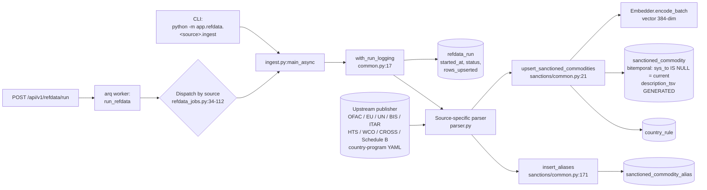

# Ingestion

Ingestion populates the reference data the screening pipeline reads at
inference time. The flows are independent — each source has its own
parser and target table — but they share a small set of helpers and the
`refdata_run` bookkeeping table.

## Flow



Three things are happening together in every ingester:

1. A `RefdataRun` row is opened in `running` state, and is updated to
   `success` or `failed` by the `with_run_logging` context manager.
2. The parser yields canonical row dicts.
3. The shared upserter performs a content-hash-driven **bitemporal** upsert:
   unchanged rows are a no-op, changed rows close the current version
   (`sys_to = now()`) and open a new one, and rows that vanished from the feed
   have their current version closed (logical delete, scoped to the source).
   Embeddings are computed in batches only for new/changed rows;
   `description_tsv` is a generated stored column, so no explicit refresh runs.

## Source matrix

| Source key | Format | Target table(s) | Idempotency key | Ingester |
|---|---|---|---|---|
| `HTS` | JSON (USITC htsdata.json) | `hs_code` (levels 2/4/6) | `code` PK | `app/refdata/hts/ingest.py` |
| `WCO` | XLSX | `hs_code` | `code` PK | `app/refdata/wco/ingest.py` |
| `ScheduleB` | CSV (US Census) | `hs_training_example` | `uq_hs_training_example(source, source_id, hs_code)` | `app/refdata/schedule_b/ingest.py` |
| `CROSS` | HTML (CBP rulings) | `hs_training_example` | same | `app/refdata/cross/scraper.py` + `ingest.py` |
| `HsEntityIndex` | Derived via GLiNER NER over `hs_code` | `hs_entity_index` | `(hs_code, entity_type, entity_value)` PK | `app/refdata/hs_entities/build.py` |
| `GoldAssembly` | Derived from `hs_training_example` | files at `eval/gold/splits/*.jsonl` | n/a (file overwrite) | `app/refdata/gold/assemble.py` |
| `OFAC_SDN` | CSV (sdn.csv, add.csv, alt.csv) | `sanctioned_commodity` + `sanctioned_commodity_alias` | `uq_sanctioned_commodity_source_recid` | `app/refdata/sanctions/ofac_sdn/ingest.py` |
| `EU_CONSOLIDATED` | XML (FSF) | `sanctioned_commodity` + aliases | same | `app/refdata/sanctions/eu_consolidated/ingest.py` |
| `UN_CONSOLIDATED` | XML | `sanctioned_commodity` + aliases | same | `app/refdata/sanctions/un/ingest.py` |
| `EU_DUAL_USE` | XLSX + crosswalk XLSX | `sanctioned_commodity` + `country_rule` | same | `app/refdata/sanctions/eu_dual_use/ingest.py` |
| `EU_RUSSIA` | XLSX per annex | `sanctioned_commodity` + `country_rule` | same | `app/refdata/sanctions/eu_russia/ingest.py` |
| `BIS_CCL` | CSV + HS crosswalk | `sanctioned_commodity` | same | `app/refdata/sanctions/bis_ccl/ingest.py` |
| `ITAR_USML` | CSV (extracted from PDF) | `sanctioned_commodity` | same | `app/refdata/sanctions/itar/ingest.py` |
| `IRAN`/`DPRK`/`SYRIA`/`CUBA`/`VENEZUELA` | YAML (`data/sanctions/country_program/*.yaml`) | `sanctioned_commodity` + `country_rule` | same | `app/refdata/sanctions/country_program/ingest.py` |

The full operator workflow for each sanctions source — provenance URLs,
file expectations, what's intentionally skipped — lives in the existing
[`sanctions-sources.md`](sanctions-sources.md). This doc focuses on
*plumbing*; that one focuses on *what to feed it*.

## Canonical row shapes

### `sanctioned_commodity` (`db/changelog/changes/0001-init.sql:51-65`)

```text
id                bigserial PRIMARY KEY
source            varchar(32) NOT NULL    -- "OFAC_SDN" | "EU_DUAL_USE" | "BIS_CCL" | ...
source_record_id  text                    -- external stable id (idempotency component)
description       text NOT NULL           -- normalized human description (≤2000 chars)
hs_codes          varchar(10)[]           -- array of 6-digit subheadings (post expansion)
restriction_type  varchar(32)             -- "blocked" | "prohibited" | "licensed" | ...
effective_from    date                    -- nullable
effective_to      date                    -- nullable
provenance_url    text                    -- publisher URL
embedding         vector(384)             -- BGE-small embedding of description
embedding_model   text                    -- encoder that produced `embedding` (item 1)
description_tsv   tsvector                -- GENERATED ALWAYS AS to_tsvector('simple', description) STORED
commodity_id      bigint                  -- logical-commodity key (shared across versions)
content_hash      bytea                   -- sha256 of audit-relevant fields (change detection)
valid_from/to     timestamptz             -- application time (when in force, reality)
sys_from/to       timestamptz             -- system time; current version == sys_to IS NULL
created_at        timestamptz DEFAULT now()
```

Unique constraint `uq_sanctioned_commodity_source_recid(source, source_record_id)`
is what makes ingest idempotent. Rows whose `source_record_id` is NULL
will be inserted every run — Postgres treats NULL as distinct in unique
constraints. This is intentional: rows without a stable upstream identity
(e.g., narrative-only sanctions) have no way to be deduped.

### `country_rule` (`db/changelog/changes/0001-init.sql:68-78`)

```text
id                       bigserial PRIMARY KEY
origin_iso               char(2)
destination_iso          char(2)
sanctioned_commodity_id  bigint REFERENCES sanctioned_commodity(id)
restriction_type         varchar(32)
conditions               jsonb
active                   boolean DEFAULT true
created_at               timestamptz DEFAULT now()
```

Unique constraint `uq_country_rule(origin_iso, destination_iso,
sanctioned_commodity_id, restriction_type)` is declared
`NULLS NOT DISTINCT` (`db/changelog/changes/0005-storage-hardening.sql`)
so an "any-origin" rule with NULL `origin_iso` still dedupes on re-ingest.

### `sanctioned_commodity_alias` (`db/changelog/changes/0003-review-fixes.sql`)

Holds aliases / AKA / transliterations joined back to `sanctioned_commodity`
via `sanctioned_commodity_id`. The trigram GIN index on `alias` powers the
fuzzy alias path in `app/pipeline/sanctions.py:101-115`. Unique constraint
`uq_alias_per_commodity(sanctioned_commodity_id, alias)`.

### `hs_code` (`db/changelog/changes/0001-init.sql:11-24`)

Three levels (`level = 2 | 4 | 6`) of the HS taxonomy, each row's
`embedding` and `description_tsv` cached for retrieval. The HNSW vector
index and the GIN tsvector index are both built at migration time.

### `hs_training_example` (`db/changelog/changes/0001-init.sql:38-47`)

(description, hs_code) pairs from CROSS rulings and Schedule B exports.
Used by:

1. Dense retrieval as an extra source of (text, code) signal —
   `app/pipeline/retrieval/dense.py:24-32` queries it alongside `hs_code`.
2. The gold-set assembler `app/refdata/gold/assemble.py`, which samples
   stratified rows from this table to build `train/dev/test.jsonl`.

## Shared helpers

These three helpers are what every sanctions ingester relies on. **Use
them when adding a new source**; do not reimplement.

### `with_run_logging` (`app/refdata/common.py:17`)

Async context manager. Opens a `RefdataRun` row in `running`, yields a
`(db, run)` tuple to the caller, and finalizes the row to `success` (with
final `rows_upserted` count) or `failed` (with the exception's first
2000 chars) on exit. Writes human-readable lines to `job_log` so the
Status UI's SSE log panel can tail them.

Typical use:

```python
async with with_run_logging("BIS_CCL", notes="ccl=2024-q3") as (db, run):
    rows = parse_ccl_xlsx(path)
    result = await upsert_sanctioned_commodities(db, rows, source="BIS_CCL", run=run)
    run.rows_upserted = result["sanctioned"]
```

### `upsert_sanctioned_commodities` (`app/refdata/sanctions/common.py:21`)

The canonical upserter. Batches by 64 rows, computes embeddings via the
shared registry Embedder, runs `ON CONFLICT DO NOTHING` against
`uq_sanctioned_commodity_source_recid`, then optionally attaches
`country_rule` rows per input. After upserting, calls
`update_tsv_for_table('sanctioned_commodity', ('description',))` so the
GIN tsvector index is fresh.

### `expand_hs_prefixes` (`app/refdata/sanctions/common.py:131-162`)

Many publishers list HS codes at 2- or 4-digit granularity (chapter or
heading). The screening pipeline joins `sanctioned_commodity.hs_codes`
against the **6-digit** shipment classifications via the `&&` array
overlap operator, so an unexpanded `"2710"` will silently never match
`"271019"`. `expand_hs_prefixes` queries `hs_code` for every 6-digit
descendant of a 2/4-digit prefix and returns the fanned-out list.

> Footgun: if the HS taxonomy hasn't been loaded yet, `expand_hs_prefixes`
> drops unresolved prefixes with a warning. **Always run `HTS` ingest
> first.** Without it, country-program YAMLs and EU annexes will write
> empty `hs_codes` arrays and silently fail to surface at screening time.

### `insert_aliases` (`app/refdata/sanctions/common.py:171`)

Idempotent alias insert against `uq_alias_per_commodity`. Looks up the
parent `sanctioned_commodity` by `(source, source_record_id)` so the
caller never has to thread the bigserial PK manually.

## Country-program YAML (annotated)

`data/sanctions/country_program/iran.yaml` is the template for all
country-program ingests. The schema:

```yaml
source: IRAN                       # Stamped into sanctioned_commodity.source.
country_iso: IR                    # ISO 3166-1 alpha-2 of the regulated country.
provenance_url: https://www.ecfr.gov/current/title-31/...   # Goes into provenance_url.

restrictions:
  - description: "Iranian-origin crude oil and petroleum products (560.206)"
    hs_codes: ["2709", "2710"]     # 2/4/6-digit; fanned out to 6-digit at ingest.
    restriction_type: blocked      # blocked | prohibited | licensed | denied
    direction: import_from         # import_from | export_to
                                   #   import_from → country_rule.origin_iso = IR
                                   #   export_to   → country_rule.destination_iso = IR
```

The ingester (`app/refdata/sanctions/country_program/ingest.py`) builds
one `sanctioned_commodity` row per restriction plus the matching
`country_rule` row(s). Re-ingesting the same YAML is a no-op thanks to
`uq_sanctioned_commodity_source_recid` (the ingester synthesizes a stable
`source_record_id` per YAML restriction).

## Triggering ingests

Three entry points, all eventually call the same `main_async`:

```text
1. From a long-running worker (Status UI → Admin button)
   POST /api/v1/refdata/run  → arq job run_refdata
   → app/workers/refdata_jobs.py:34 dispatches by `source` string

2. From the CLI (operator on a host with DB access)
   python -m app.refdata.sanctions.eu_dual_use.ingest --file <path>

3. Programmatically (tests, batch scripts)
   await main_async(path, ...)
```

The dispatch table in `app/workers/refdata_jobs.py` is the source of
truth for which `source` strings the system accepts and which optional
parameters each one takes (e.g., `EU_RUSSIA` accepts `direction` and
`annex`, `OFAC_SDN` accepts `sdn`/`add`/`alt` paths).

## Idempotency in one paragraph

Re-running any ingester is safe: every sanctioned row is upserted on
`(source, source_record_id)`; every country rule is upserted on
`(origin_iso, destination_iso, sanctioned_commodity_id, restriction_type)`
with `NULLS NOT DISTINCT`; every alias is upserted on
`(sanctioned_commodity_id, alias)`; every training example is upserted
on `(source, source_id, hs_code)` with `NULLS NOT DISTINCT`. Updates use
INSERT + ON CONFLICT DO NOTHING — there is no UPDATE path. A full
refresh is a delete + re-ingest, not an in-place modification.

## Observability

- `RefdataRun` rows are the canonical log of every ingest attempt
  (`source`, `started_at`, `finished_at`, `status`, `rows_upserted`,
  `error_message`). Index `refdata_run_source_started` makes
  "latest run for source X" fast.
- `JobLog` rows record streamed progress messages keyed by
  `(run_table, run_id)`. The Status UI tails these over SSE.
- `app/pipeline/versions.py:refdata_snapshot` is the read path the
  inference pipeline uses to stamp "what refdata was live when this
  screening ran" into the `versions` block on every `ScreeningResult`.
