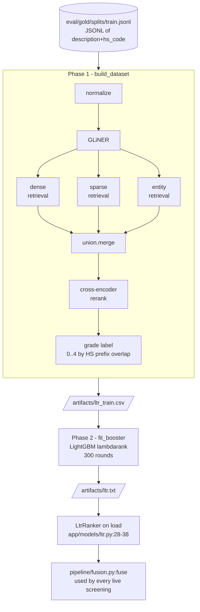

# Training

Only one model is trained inside this repo: the LightGBM lambdarank LTR
that combines retrieval signals into the final fused HS score
(`app/pipeline/fusion.py:25`). Everything else — BGE-small embedder,
BGE-reranker, GLiNER NER — is a pretrained checkpoint loaded from the
HuggingFace cache via `app/models/registry.py`.

## Flow



The dataset-building phase runs the *exact* retrieval stack that runs at
inference time. That gives the booster training data with the same
feature distribution it'll see in production.

## Lineage in detail

### Where gold comes from

`eval/gold/splits/{train,dev,test}.jsonl` are assembled by
`app/refdata/gold/assemble.py` from already-ingested `hs_training_example`
rows (CROSS rulings + Schedule B). Stratified by 2-digit chapter, 70/15/15
split per chapter to avoid leakage. **Real-data only** — the repo
ships no hand-written gold (see `eval/gold/README.md`).

Each line in `train.jsonl` is a JSON object with two keys:

```json
{"description": "Silicon wafers, 300mm, doped, electronics grade", "hs_code": "381800"}
```

### Phase 1 — `build_dataset` (`app/training/ltr_dataset.py:72`)

For each gold row:

1. `_features_for_query` (`:52-61`) normalizes the text, extracts NER,
   runs `dense` + `sparse` + `entity` retrieval in parallel,
   merges with `union.merge`, then reranks with the cross-encoder.
2. The result is a list of candidate dicts with the same shape the
   inference path produces: `dense_similarity`, `sparse_score`,
   `entity_overlap_score`, `cross_encoder_score`, plus metadata.
3. Each candidate gets a relevance label by `_grade` (`:35-49`)
   against the gold HS code:

   | Label | Meaning |
   |---|---|
   | 4 | exact subheading (6-digit equal) |
   | 3 | same heading (4-digit prefix match) |
   | 2 | same chapter (2-digit prefix match) |
   | 1 | adjacent chapter (chapter ± 1) |
   | 0 | otherwise |

4. The (qid, candidate, features, label) row is appended to
   `artifacts/ltr_train.csv` with these columns
   (`app/training/ltr_dataset.py:96-110`):

   ```
   qid, label,
   dense_similarity, sparse_score, entity_overlap_score, cross_encoder_score,
   chapter_prior, candidate_depth, top1_minus_top2_gap,
   hs_code, gold_hs_code
   ```

`chapter_prior` and `top1_minus_top2_gap` are set to 0 in training
(`:104,106`) because they're computed at fusion time over the candidate
list, not per (query, candidate). Their inference-time values do reach
the booster — see `app/pipeline/fusion.py:16-22, 30-38`.

### Phase 2 — `fit_booster` (`app/training/ltr_train.py:23`)

```python
params = {
    "objective": "lambdarank",
    "metric": "ndcg",
    "ndcg_eval_at": [1, 3, 5],
    "learning_rate": 0.05,
    "num_leaves": 31,
    "min_data_in_leaf": 5,
    "verbose": -1,
}
booster = lgb.train(params, train_set, num_boost_round=300)
booster.save_model("artifacts/ltr.txt")
```

The dataset is grouped by `qid` so lambdarank's pairwise loss compares
candidates within a query, not across queries. Training-set NDCG@1/3/5
is logged for the UI.

### Live pickup — `LtrRanker` (`app/models/ltr.py:21-51`)

The model registry constructs `LtrRanker(path=settings.ltr_model_path)`
once at process startup. If the file exists at the configured path
(default `./artifacts/ltr.txt`), it's loaded; otherwise a deterministic
linear-blend fallback (`:48-50`) keeps the pipeline runnable end-to-end
before the first training cycle.

The booster is invoked from `app/pipeline/fusion.py:54 ltr.predict(feats)`
inside the request path. Predictions are stamped back onto the candidate
dicts as `score` and `score_components.ltr_final`
(`app/pipeline/fusion.py:62-64`).

## Feature contract — handle with care

The exact feature list **and order** lives in `app/models/ltr.py:10-18`:

```python
FEATURE_ORDER = [
    "dense_similarity",
    "sparse_score",
    "entity_overlap_score",
    "cross_encoder_score",
    "chapter_prior",
    "candidate_depth",
    "top1_minus_top2_gap",
]
```

Both training (`app/training/ltr_train.py:38`) and inference
(`app/pipeline/fusion.py:40-52`) materialize the feature vector in this
order. If you add or rename a feature:

1. Update `FEATURE_ORDER`.
2. Update `app/pipeline/fusion.py` to emit the new field.
3. Update `app/training/ltr_dataset.py` to capture it during dataset
   build.
4. Retrain the booster.
5. Deploy the new booster and the code changes **together**. Mismatched
   `FEATURE_ORDER` between booster and inference is silent corruption.

## Triggering training

### From the API / UI

```text
POST /api/v1/training/ltr/run
```

`app/api/routes_training.py:run_ltr_training` enqueues the arq job
`train_ltr` (`app/workers/training_jobs.py:42`) with optional params:

| Param | Default | Meaning |
|---|---|---|
| `gold` | `eval/gold/splits/train.jsonl` | input gold split |
| `dataset_csv` | `artifacts/ltr_train.csv` | intermediate features file |
| `artifact` | `artifacts/ltr.txt` | output booster |
| `limit` | unset | optional sample cap for dev runs |

The worker writes a `TrainingRun` row
(`app/db/models.py:264-275`) — `kind="ltr"`, `status="running"` then
`success`/`failed` — and streams progress lines to `job_log`. The
Status UI reads both.

### From the CLI

Useful for local iteration:

```bash
python -m app.training.ltr_dataset --gold eval/gold/splits/train.jsonl --out artifacts/ltr_train.csv
python -m app.training.ltr_train  --in artifacts/ltr_train.csv --out artifacts/ltr.txt
```

Either step can be re-run independently; `ltr_train` reads the CSV that
`ltr_dataset` wrote.

## Reloading the live model

The FastAPI lifespan handler loads the booster **once at startup**
(`app/main.py:33 load_models()`). A newly-trained `artifacts/ltr.txt`
is not picked up automatically — restart the API process (or the worker
process for batch screening) after each training run.

Per-screening provenance is captured in
`ScreeningResult.versions["ltr_hash"]` (a sha256 of the loaded file,
`app/pipeline/versions.py:26-34`), so it's straightforward to detect
which version of the booster produced any given screening when
debugging eval regressions.

## What's *not* trained here

| Model | Wrapper | Source |
|---|---|---|
| Embedder (BGE-small-en-v1.5) | `app/models/embedder.py` | HuggingFace pretrained; `settings.embedder_model` |
| Reranker (BGE-reranker-v2-m3) | `app/models/reranker.py` | HuggingFace pretrained; `settings.reranker_model` |
| NER (GLiNER small) | `app/models/ner_model.py` | HuggingFace pretrained; `settings.ner_model` |

Swapping any of these is a config change (set the env var, restart) plus
a retrain of the LTR — the cross-encoder score distribution shifts when
the reranker model changes, and the LTR was fit on the previous
distribution.
